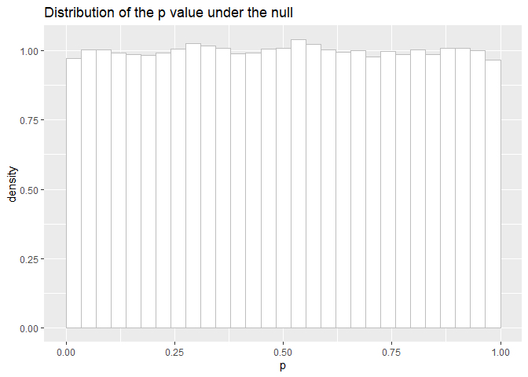

P curve under no effect
================

It is important to understand that the \(p\) value is itself a random
variable. In other words, the same (statistical) question will give
raise to varying results everytime an experiment is carried out to try
to answer it.

How consistent an answer the \(p\) value can give can be investigated
*in silico* using replication and the `replicate()` function.

Let’s first load the required libraries:

``` r
library("tidyverse")
```

    -- Attaching packages ------------------------------------ tidyverse 1.3.0 --

    v ggplot2 3.3.0     v purrr   0.3.3
    v tibble  2.1.3     v dplyr   0.8.5
    v tidyr   1.0.2     v stringr 1.4.0
    v readr   1.3.1     v forcats 0.5.0

    -- Conflicts --------------------------------------- tidyverse_conflicts() --
    x dplyr::filter() masks stats::filter()
    x dplyr::lag()    masks stats::lag()

Here two sets of numbers \(x\) and \(y\) are drawn from the same
distribution.

``` r
R = 100000 # Number of replicated
n = 10     # Group size

psim1 = replicate(R, {
    x = rnorm(n, mean=0, sd=1)
    y = rnorm(n, mean=0, sd=1)
    
    t = t.test(x, y)
    t$p.value
})
```

The distribution can be shown using `hist(psim1)` or the ggplot2
functions:

``` r
qplot(psim1, geom="histogram", breaks=seq(0, 1, len=30))
```

<!-- -->

A perhaps more pleasant result can be obtained using

``` r
ggplot(tibble(p=psim1), aes(p, ..density..)) +
    geom_histogram(breaks=seq(0, 1, len=30),
                   fill='white', colour='gray') +
    ggtitle("Distribution of the p value under the null")
```

<!-- -->

This histogram is called a “\(p\) curve”.

The interesting point is that a \(p\) value when the null hypothesis is
indeed true is uniformly distributed between \(0\) and \(1\). The \(p\)
value behaves as if it is drawn from a uniform distribution `runif(1)`.
When the null hypothesis is true, the \(p\) curve is flat.

Note that the flatness means that occasionally, \(p\) values will reach
very small values. In fact, \(5\)% of the time, the \(p\) value will
reach significance levels of \(0.05\) since the distribution is flat.

# fonctions

``` r
test<-function(n=10,moy=0,et=1){
  X=rnorm(n,0,1)
  Y=rnorm(n,moy,et)
  
  result=t.test(X,Y)
  
  result$p.value
}

testexp<-function(n=10,rate=1){
  X=rexp(n,1)
  Y=rexp(n,rate)
  
  result=t.test(X,Y)
  
  result$p.value
}
```

# Production d’un ensemble de pvalue (100000) avec effet

On lance 1000 fois le tirage et le calcul du test, mais cette fois-ci
avec une moyenne à 0.3 ce qui simule un effet significatif

``` r
p = replicate(100000, test(moy=0.3))
```

# Affichage de la distribution rnorm effet

``` r
hist(p)
```

<!-- -->

On constate une répartition non uniforme des pvalues.

# Production d’un ensemble de pvalue (1000) avec non-standard conditions

On lance 1000 fois le tirage et le calcul du test.

Comme test a les valeurs par défaut, les distrib X et Y sont identiques.

``` r
p = replicate(100000, testexp(rate=1))
```

# Affichage de la distribution exp sans effet

``` r
hist(p)
```

<!-- -->

On constate une répartition quasi uniforme des pvalues

# Production d’un ensemble de pvalue (1000) avec echelle de 5

``` r
p = replicate(100000, testexp(rate=5))
```

# Affichage de la distribution exp avec effet

``` r
hist(p)
```

<!-- -->

On constate une répartition divergente des pvalues
